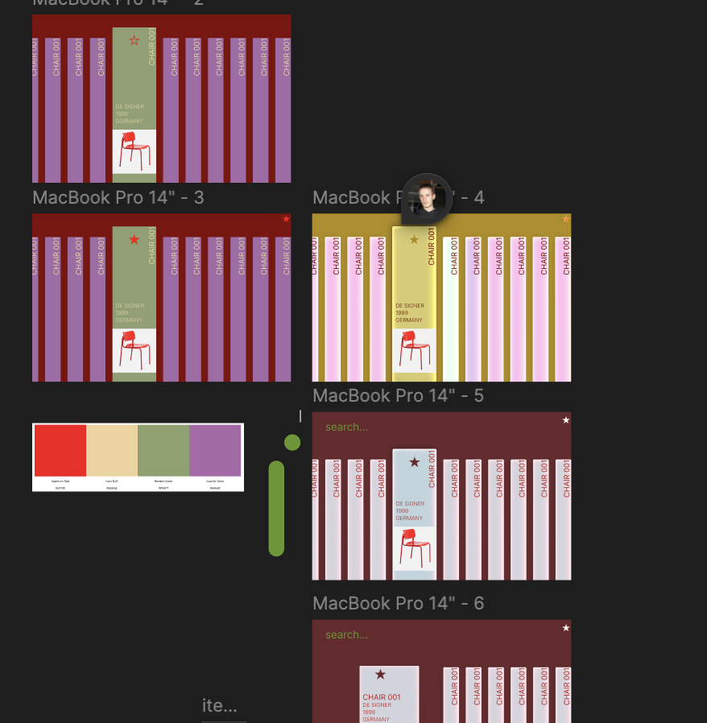

## Project Description:
LCS 003 is going to be a full-stack web application where users can explore a collection of iconic and respected design works as included in the Cooper Hewitt, Smithsonian Design Museum collection. The app is more about learning and discovery than anything. Users will be able to scroll through the entire collection of works, search by country, material, year, title, (and more),  and can save works into a new or existing favorites collection, of which there may be multiple (i.e. a "red pieces" collection, a "Dutch Chairs" collection, etc.) —similar in the way that you can have different boards on

## Mockups:

# *intended for project 4 design, but informs fundamental shape of Project 3*

## User Personas:

- **Logan (professional interior designer):** is a designer and he wants to scroll through some well known designs to pull inspiration from so that he can create a nice interior proposal for a client.
- **Christopher (student):** is a first year student at art school, and he needs to practice sketching objects for his intro to product design course. He wants to have a bunch options easily accessible to him so he can spend more time sketching and less time searching

## User Stories

- as an interior designer,**Logan** wants to save and keep track of specific pieces he has found so that he can reference them with ease later in his work.
- as a new student in art school,**Christopher** wants to both explore revered design and practice sketching for his class so that he can excel in his education